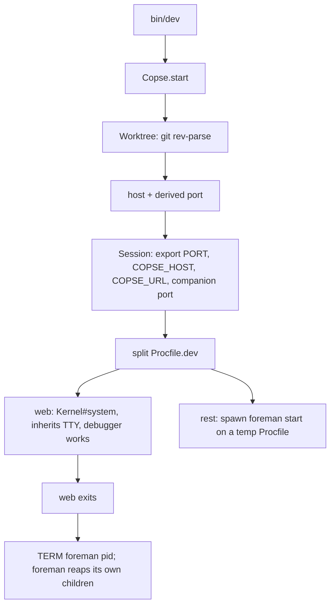

# feat: Copse — per-worktree hostnames and ports for Rails development

## Goal Capsule

- **Objective:** Ship `copse` to RubyGems — a development-only gem that gives every Rails app and every git worktree on a machine its own hostname and its own port, with no daemon, no DNS configuration, and no privileged listener.
- **Current state (reconciled 2026-07-21):** Greenfield. The `copse/` directory is an empty, freshly-initialized git repository — none of the gem source described below exists yet. The original plan's Goal Capsule described the core as "built and tested" and marked U3 and U6 as "Landed"; that was not true of this checkout, so **every unit U1–U6 is to be built from scratch**, along with the gem scaffolding (gemspec, `Rakefile`, `lib/copse.rb`, entry points, test harness). The unit bodies below preserve the original technical design; the "Landed" units become buildable units.
- **Product authority:** This plan's Product Contract. Where it conflicts with the README to be written, the plan wins and the README is written to match.
- **Execution profile:** Small, self-contained Ruby gem. No app integration, no migrations, no services. Ruby 3.2+, Minitest, zero runtime dependencies.
- **Stop conditions:** Stop and ask if a unit's findings would require introducing a background daemon, a reverse proxy, a privileged listener, or a runtime dependency. Each reverses a settled decision (KTD1, KTD6) and changes what the gem is.
- **Tail ownership:** Single PR building the whole gem, opened against `main` in a new standalone GitHub repository. Do not run `gem push` to RubyGems as part of this pipeline — publishing is a human-gated release step (see U5); the pipeline prepares everything up to and including a green CI, and leaves the actual `rubygems.org` push to the user.

---

## Product Contract

### Summary

Every Rails app defaults to port 3000, so the second one on a machine will not boot. Copse gives each app and worktree a derived hostname and a derived port, so nothing collides and nothing has to be chosen. The hostname is not routing traffic — it gives each app a distinct browser origin, which removes the shared-cookie-jar problem. Because no proxy is involved, the gem installs with a Gemfile line and a generator and runs nothing in the background.

### Problem Frame

A developer running several Rails apps, or several worktrees of one app, currently hand-assigns ports with `-p 3001` and then cannot remember which app owns which number. Teams do it differently from each other, so URLs are not shareable. Worse, everything lands on `localhost`, so all apps share one cookie jar and one `localStorage`: signing into one signs the developer out of the others, and any app with subdomain or session behavior acts nothing like production.

The existing answer is puma-dev, which solves naming well but moves the web server into a background daemon. That costs the foreground TTY, and with it `binding.irb` and interactive debugging. Rails' own `bin/dev` has the mirror-image problem: it keeps everything local but multiplexes stdin and stdout through foreman, which makes the debugger unusable (rails/rails#52459). Neither path gives a developer both a stable name and a working debugger.

### Requirements

**Naming and addressing**
- R1. A project's main worktree is reachable at `<project>.localhost`, derived from the main worktree's directory name, dasherized.
- R2. A linked worktree is reachable at `<branch>.<project>.localhost`, derived from its current branch.
- R3. A worktree on a detached `HEAD` falls back to its directory name as the slug.
- R4. Each hostname maps to a port that is a pure function of that hostname, so it is identical across reboots, terminals, and teammates without any stored state.

**Process management**
- R5. The `web` process from `Procfile.dev` runs in the foreground and owns the TTY, so `binding.irb` and `debug` behave as they do under a bare `rails server`.
- R6. All other `Procfile.dev` processes run under foreman and are terminated when the foreground process exits.
- R7. An app with no `Procfile.dev` boots `bin/rails server` rather than failing.
- R8. Every process started by Copse receives `PORT`, `COPSE_HOST`, and `COPSE_URL`.

**Rails integration**
- R13. In development, when the app was booted by Copse and has not set its own `host`, `default_url_options` for routes and Action Mailer resolve to the Copse hostname and port.
- R14. Rails reports the Copse URL on boot.
- R15. A plain `bin/rails server` and any non-development environment are unaffected.

**Installation**
- R9. `bin/rails generate copse:install` points `bin/dev` at Copse and creates a minimal `Procfile.dev` only when the app has none.
- R10. The generator is idempotent and never silently overwrites an existing `Procfile.dev`.

**Packaging**
- R11. The gem declares zero runtime dependencies.
- R12. The gem is installable from RubyGems and its README documents the trade it makes against puma-dev.

### Acceptance Examples

- AE1. Five apps, one worktree each. Given five Rails apps in sibling directories, when each runs `bin/dev`, then all five boot simultaneously on distinct hostnames and distinct ports. (Covers R1, R4)
- AE2. Three worktrees, one project. Given `~/code/cora` on `main` plus `~/code/cora-fix-billing` on `fix-billing`, when both run `bin/dev`, then they resolve to `cora.localhost` and `fix-billing.cora.localhost` on different ports. (Covers R2, R4)
- AE3. Debugger survives. Given a `Procfile.dev` with `web` and `css`, when a request hits a `binding.irb`, then the prompt appears and echoes keystrokes. (Covers R5, R6)
- AE4. Existing Procfile preserved. Given an app whose `Procfile.dev` already has a `tailwindcss:watch` line, when the generator runs, then that file is untouched. (Covers R10)

### Scope Boundaries

**Deferred for later**
- Deriving ports for JS bundlers is in scope for this plan (U2), but only through environment variables — not by parsing or rewriting bundler config.

**Outside this product's identity**
- No reverse proxy, no background daemon, no TLS, no certificate authority. Removing `:3000` from the URL is not worth a privileged listener; puma-dev already occupies that trade and does it well.
- No port registry, lock file, or coordination service. Derived-and-uncoordinated is the design (KTD3).
- No `/etc/hosts` management. If a host needs an entry, the gem documents it rather than editing system files.

**Deferred to Follow-Up Work**
- Actual `gem push` to rubygems.org is a human-gated release action, not part of this build pipeline (see U5 and Tail ownership).

### Outstanding Questions

- Q1. (deferred) Should the gem ship a way to raise the collision ceiling for developers running 40+ worktrees, where the measured rate reaches 10%? Every mechanism that would fix it needs shared state. Not worth it until someone asks.
- Q2. (deferred) Should the gem support a per-app name override — a `.copse` file or a `Copse.name =` setting — for teams whose directory name differs from the name they want in the URL? No demand yet; derived-only until asked.

### Sources

- rails/rails#52459 — DHH's proposal to run the web process in the foreground and delegate the remaining `Procfile.dev` entries to foreman. This is the shape U1 must preserve.
- `ActionDispatch::HostAuthorization::ALLOWED_HOSTS_IN_DEVELOPMENT` — includes `".localhost"` and `".test"`, which is why no `config.hosts` change is needed. Verify against the app's actual Rails version rather than assuming.
- RFC 6761 §6.3 — reserves `localhost`; browser treatment of `*.localhost` subdomains is a browser implementation choice, not a resolver guarantee. U4 exists because of this distinction.
- puma-dev — the incumbent and the honest alternative for anyone who wants a bare `https://app.test`.

---

## Planning Contract

### Key Technical Decisions

- KTD1. No daemon and no reverse proxy. (session-settled: user-directed — chosen over a puma-dev-style background daemon and over generating a Caddy config: a daemon takes the web process off the TTY, which is the debugger property this gem exists to keep.)
- KTD2. The hostname carries identity, not routing. Requests still go to a port; the name exists to give each app a distinct browser origin. (session-settled: user-approved — chosen over proxying by `Host` header: the origin isolation is the valuable half, and it needs no listener.)
- KTD3. Ports are derived by CRC32 of the hostname onto the available ports in `3000..9999`, with no coordination. (session-settled: user-approved — chosen over a shared registry or bind-and-probe: both reintroduce state, and probing breaks the stable-across-terminals property in R4.)
- KTD3a. Well-known service ports inside the range are excluded from derivation rather than probed around, so derivation stays pure. Widening from `3000..3999` to `3000..9999` drops the ten-name collision rate from 3.5% to 0.7% (measured over 20,000 trials — the plan's build must reproduce a test asserting the bound, not merely cite it).
- KTD4. A linked worktree's slug comes from its branch name, falling back to the directory name. (session-settled: user-approved — chosen over always using the directory name: conventional directory names like `cora-fix-billing` produce `cora-fix-billing.cora.localhost`, repeating the project.)
- KTD5. Installation is a Rails generator, not documentation. (session-settled: user-directed — chosen over README-only instructions: matches `tailwindcss:install` and lets the app commit a `bin/dev` the whole team shares.)
- KTD6. Zero runtime dependencies; `railties` is a development dependency in `Gemfile` only, never in the gemspec. Foreman is invoked as a subprocess, not required.
- KTD7. Teardown signals foreman's pid directly and lets foreman reap its own children. An earlier draft signalled the process group via `Process.getpgid`, which can resolve to the caller's own group and kill the developer's shell session. Do not reintroduce group signalling without a guard that the target group is not the caller's.

### High-Level Technical Design

Two objects and a generator, plus a railtie.

- `Copse::Worktree` answers "what am I called and what port do I get" by shelling out to git. It holds no state and touches no files. The host slug is the branch of a linked worktree (KTD4), falling back to the directory name on detached HEAD (R3); the main worktree uses its directory name (R1). The port is a pure CRC32-of-hostname mapping onto the available-ports set (KTD3, KTD3a).
- `Copse::Session` answers "how do I boot" by splitting `Procfile.dev` into the foreground `web` process and the rest. `web` runs through `Kernel#system` so it inherits the terminal directly (R5); the remaining lines run under a `foreman start` subprocess against a temporary Procfile (R6); teardown TERMs foreman's pid (KTD7). An app with no `Procfile.dev` boots `bin/rails server` (R7). Every child sees `PORT`, `COPSE_HOST`, `COPSE_URL`, and the companion bundler port (R8, U2).
- `Copse::Railtie` sets `default_url_options` for routes and Action Mailer from the exported env and prints the boot line, guarded three ways (development only, `COPSE_URL` present, app has not set its own host) — R13/R14/R15.
- `Copse::Generators::InstallGenerator` rewrites `bin/dev` to call Copse and writes a minimal `Procfile.dev` only when absent (R9/R10).



The load-bearing property is that `web` runs through `system` rather than through foreman, so it inherits the terminal directly. Everything else serves that.

### Output Structure

```text
copse/
├── copse.gemspec
├── Gemfile
├── Rakefile
├── README.md
├── CHANGELOG.md
├── LICENSE.txt
├── .github/
│   └── workflows/
│       └── ci.yml
├── lib/
│   ├── copse.rb
│   ├── copse/
│   │   ├── version.rb
│   │   ├── worktree.rb
│   │   ├── session.rb
│   │   └── railtie.rb
│   └── generators/
│       └── copse/
│           ├── install_generator.rb
│           └── templates/
│               ├── dev.tt
│               └── Procfile.dev.tt
└── test/
    ├── test_helper.rb
    └── copse_test.rb
```

The tree is a scope declaration, not a constraint; the per-unit **Files** sections are authoritative for what each unit creates.

### Assumptions

- Foreman terminates its own children on `SIGTERM`. U1 must confirm this rather than trust it; if it does not, the fallback is a guarded process-group kill that refuses to signal the caller's own group (KTD7).
- The target app is on a Rails version whose development host allowlist includes `.localhost`. Apps older than that need one `config.hosts` line, which U4 documents.
- Developers use Chrome or Firefox as their primary development browser. U4 tests this assumption rather than resting on it.
- Foreman is available on the developer's PATH at runtime (invoked as a subprocess, not depended on as a gem — KTD6). U1's missing-binary scenario covers its absence.

### Sequencing

Because this is a greenfield build, U0 (scaffolding) lands first and everything depends on it. Then the identity/port core (U3 — needed by Session and Railtie), Session (U1), Rails integration (U6), companion ports (U2). U4 (resolution matrix) and U5 (release engineering) are documentation/packaging and land last. U1 and U4 remain the risk units for their respective claims.

---

## Implementation Units

### U0. Gem scaffolding and test harness

- **Goal:** A buildable, testable, zero-runtime-dependency gem skeleton that the remaining units fill in.
- **Requirements:** R11 (zero runtime deps), foundation for all others.
- **Dependencies:** none.
- **Files:** `copse.gemspec`, `Gemfile`, `Rakefile`, `lib/copse.rb`, `lib/copse/version.rb`, `test/test_helper.rb`, `.gitignore`.
- **Approach:** Standard Andrew-Kane-style minimal gem layout. `copse.gemspec` declares zero runtime dependencies and lists `railties` + `minitest` + `rake` as development dependencies only (KTD6); required Ruby `>= 3.2`. `lib/copse.rb` defines the `Copse` module, its configuration accessors (`ports=`, `reserved_ports=` with memo invalidation — see U3), and the top-level `Copse.start` entry point that `bin/dev` calls. `Rakefile` wires the default task to Minitest. `require "copse/railtie" if defined?(Rails::Railtie)` so a non-Rails consumer never fails to load.
- **Patterns to follow:** `andrew-kane-gem-writer` conventions — flat `lib/<gem>.rb` + `lib/<gem>/*.rb`, thin gemspec, Minitest.
- **Test scenarios:** `Copse::VERSION` is a frozen string. `Copse.start` is defined. The gem loads cleanly with no `Rails` constant present (guarded railtie require does not raise).
- **Verification:** `rake test` runs (even if only the smoke test exists yet); `ruby -Ilib -e "require 'copse'"` succeeds outside Rails.

### U3. Port and hostname derivation (identity core)

- **Goal:** Pure, stateless derivation of a hostname's port, and of a worktree's hostname, with a documented collision bound.
- **Requirements:** R1, R2, R3, R4; KTD3, KTD3a, KTD4.
- **Dependencies:** U0.
- **Files:** `lib/copse/worktree.rb`, `lib/copse.rb` (config accessors), `test/copse_test.rb`.
- **Approach:** `Copse::Worktree` shells to git (`git rev-parse --is-inside-work-tree`, `--show-toplevel`, `--abbrev-ref HEAD`, and the main-worktree path) to decide project name and branch. Host: main worktree → dasherized directory basename `<project>.localhost` (R1); linked worktree → `<branch>.<project>.localhost` (R2, KTD4); detached HEAD → directory basename as slug (R3). Port: CRC32 of the full hostname string mapped onto the **available** ports set = `(3000..9999)` minus ~25 well-known service ports, ≈6,975 ports (KTD3, KTD3a). A reserved port is unreachable by construction (index into the available array), not avoided by probing. `Copse.ports=` and `Copse.reserved_ports=` invalidate the memoized available-list so reconfiguration cannot go stale. Use Ruby stdlib `Zlib.crc32` — no new dependency.
- **Test scenarios:**
  - `Covers AE1 / AE2.` Distinct hostnames derive distinct ports across a representative sample; same hostname derives the same port on repeated calls (R4 stability).
  - Derived ports never land on a reserved port (`test_derived_ports_never_land_on_a_reserved_port`).
  - Collision rate over 20,000 synthetic ten-name trials stays within the documented 0.7% bound (`test_collision_rate_stays_within_the_documented_bound`).
  - Reconfiguring `Copse.ports=` / `Copse.reserved_ports=` takes effect immediately (`test_reconfiguring_the_range_takes_effect_immediately`).
  - Main worktree → `<project>.localhost`; linked worktree on `fix-billing` → `fix-billing.cora.localhost`; detached HEAD → directory-name slug.
  - Branch names with slashes or capitals dasherize to a valid host label.
- **Verification:** `rake test` green for the identity suite; hostnames match R1–R3 examples; collision-bound test passes.

### U1. Session boot and process teardown

- **Goal:** Boot the app with `web` in the foreground owning the TTY and the rest under foreman, and prove that exiting or interrupting leaves no orphaned foreman or watcher processes.
- **Requirements:** R5, R6, R7, R8; KTD7.
- **Dependencies:** U0, U3.
- **Files:** `lib/copse/session.rb`, `test/copse_test.rb`.
- **Approach:** `Copse::Session` reads `Procfile.dev`, splits off `web`, exports `PORT`, `COPSE_HOST`, `COPSE_URL` (and the U2 companion port) into the child environment, runs the remaining lines by spawning `foreman start` against a temp Procfile, and runs `web` through `Kernel#system` so it inherits the terminal (R5, rails/rails#52459 shape). No `Procfile.dev` → boot `bin/rails server` (R7). Teardown TERMs foreman's own pid and lets foreman reap its children (KTD7) inside an `ensure`; add an explicit `SIGINT` trap if needed so `ensure` runs before the process dies. Missing `foreman` binary → a clear one-line error, not a stack trace. If foreman is found not to reap its children, add a group kill **guarded** so it refuses to signal the caller's own process group — never the unguarded form.
- **Execution note:** Exercise the real path with a real temp `Procfile.dev` (`web` + a long-running secondary such as `sleep`), and assert on process state after each exit; do not mock the process tree away.
- **Test scenarios:**
  - `Covers AE3.` Web exits normally → secondaries are gone (no orphaned pids).
  - Interrupt (SIGINT/SIGTERM to the session) mid-run → secondaries gone.
  - Missing `foreman` binary → clear error message, no stack trace.
  - Teardown when the secondary already died on its own → does not raise.
  - No `Procfile.dev` present → invokes `bin/rails server` path.
  - Child environment contains `PORT`, `COPSE_HOST`, `COPSE_URL`.
- **Verification:** `rake test` green. Manual gate (documented, not automated here): `Ctrl-C` in a real Rails app with a Tailwind line in `Procfile.dev`, then `ps` confirms nothing survives; `binding.irb` in a controller shows a prompt that echoes keystrokes.

### U6. Rails URL integration (railtie)

- **Goal:** Generated URLs use the Copse hostname and port in development, and Rails prints the Copse URL on boot; everything else is untouched.
- **Requirements:** R13, R14, R15.
- **Dependencies:** U0, U3.
- **Files:** `lib/copse/railtie.rb`, `test/copse_test.rb`.
- **Approach:** `Copse::Railtie` reads `COPSE_URL`/`COPSE_HOST`/`PORT` from the environment and sets `Rails.application.routes.default_url_options` and Action Mailer's `default_url_options` to the Copse host/port. Reach Action Mailer via `ActiveSupport.on_load(:action_mailer)` (never `config.action_mailer`, which raises `NoMethodError` in apps that do not load Action Mailer). Guard three ways: `Rails.env.development?`, `COPSE_URL` present, and the app has not already set its own `host`. Print the boot line (R14). Puma's own `Listening on http://127.0.0.1:<port>` line still prints and is documented, not worked around (binding to the hostname would depend on the system resolver — see U4).
- **Test scenarios:**
  - With `COPSE_URL` set in development and no app-set host → routes and mailer `default_url_options` resolve to the Copse host/port.
  - App has already set its own `host` → Copse does not override.
  - Non-development environment → untouched.
  - `COPSE_URL` absent → untouched (plain `bin/rails server`).
  - Action Mailer not loaded → no `NoMethodError`.
- **Verification:** `rake test` green (`UrlOptionsTest`). Behavior confirmed against a booted `Rails::Application` in the test harness where feasible.

### U9. Install generator

- **Goal:** `bin/rails generate copse:install` wires an app to Copse idempotently.
- **Requirements:** R9, R10; KTD5.
- **Dependencies:** U0.
- **Files:** `lib/generators/copse/install_generator.rb`, `lib/generators/copse/templates/dev.tt`, `lib/generators/copse/templates/Procfile.dev.tt`, `test/copse_test.rb`.
- **Approach:** A `Rails::Generators::Base` subclass. Rewrites/creates `bin/dev` from `dev.tt` so it calls `Copse.start` (and `chmod +x`). Creates `Procfile.dev` from the template **only when the app has none** — never overwrites an existing one (R10, AE4). Idempotent: running twice is a no-op on an already-wired app. Matches the shape of `tailwindcss:install` (KTD5).
- **Test scenarios:**
  - `Covers AE4.` App with an existing `Procfile.dev` (e.g. a `tailwindcss:watch` line) → file untouched.
  - App with no `Procfile.dev` → minimal one created with a `web` line.
  - `bin/dev` created and executable, pointing at Copse.
  - Running the generator twice → no duplicate lines, no overwrite.
- **Verification:** `rake test` green; generator run in a scratch dir produces the expected `bin/dev` and preserves an existing `Procfile.dev`.

> Note: U9 covers the install generator that the original plan referenced under `lib/generators/copse/install_generator.rb` but did not enumerate as its own remaining unit (it was implicitly part of the "already built" core). Because this is a greenfield build, it is called out explicitly. R9/R10 and AE4 are owned here.

### U2. Companion ports for JS bundlers

- **Goal:** Two worktrees running Vite or esbuild no longer collide on the bundler's own port.
- **Requirements:** R4, R8.
- **Dependencies:** U0, U3, U1.
- **Files:** `lib/copse/session.rb`, `README.md`, `test/copse_test.rb`.
- **Approach:** Derive a companion port from the same hostname (so it inherits R4 stability) but kept clear of the primary port, and export it into the child environment under the variable each supported bundler already reads (e.g. `VITE_RUBY_PORT` for vite_ruby). Do not parse or rewrite bundler config files. Document the automatic behavior in the README, replacing any manual `VITE_RUBY_PORT` instruction.
- **Test scenarios:**
  - Companion port is stable for a hostname and differs across worktrees.
  - Companion port never equals the primary port for the same hostname.
  - An app with no bundler is unaffected (variable simply present in env, nothing consumes it).
- **Verification:** `rake test` green. Manual gate (documented): two worktrees of a Vite app boot simultaneously and serve assets in both.

### U4. Hostname resolution matrix and README correction

- **Goal:** Establish where `*.localhost` actually resolves and write the README so it makes no claim contradicted by the facts.
- **Requirements:** R1, R2, R12.
- **Dependencies:** U0 (README exists), all core units (so the README documents real behavior).
- **Files:** `README.md`.
- **Approach:** RFC 6761 reserves `localhost`, but resolving arbitrary `*.localhost` subdomains is browser-level behavior, not a system-resolver guarantee. Chrome and Firefox handle it; Safari, `curl`, and macOS system resolvers may not. The README states this plainly: a verified matrix of {Chrome, Firefox, Safari, curl} × {macOS, Linux} against a main-worktree and a nested-worktree hostname, and a one-line `/etc/hosts` fallback wherever resolution fails, naming which tools need it. Scope any "no `/etc/hosts` needed" claim to the browsers where it holds. Restate the puma-dev trade honestly where puma-dev's resolver approach does not have this gap. The matrix cells that cannot be executed in this headless environment are marked as such and documented as the manual verification gate rather than asserted as verified.
- **Test scenarios:** Test expectation: none — documentation unit. The verification is a manual browser/CLI matrix, recorded in the README as its verification gate.
- **Verification:** README contains the resolution matrix, the `/etc/hosts` fallback, and no overclaim. Manual gate: run the matrix on a real machine and fill verified cells.

### U5. Release engineering

- **Goal:** Everything needed to publish 0.1.0 to RubyGems, with CI proving the suite on supported Rubies — up to but not including the human-gated `gem push`.
- **Requirements:** R11, R12.
- **Dependencies:** U0–U9.
- **Note:** `lib/copse/railtie.rb` and `lib/generators/**` (including `templates/`) must be in the packaged file list — the gem is useless if templates are omitted.
- **Files:** `copse.gemspec`, `.github/workflows/ci.yml`, `LICENSE.txt`, `CHANGELOG.md`, `README.md`.
- **Approach:** Add the MIT `LICENSE.txt` the gemspec claims. Fill the gemspec `homepage`/`source_code_uri`/`changelog_uri` with the real repository URL once the GitHub repo exists. Ensure the gemspec `files` list (or `git ls-files`-based glob) captures `lib/generators` and its `templates/`. Add a CI workflow running `rake test` across supported Ruby versions on Linux and macOS (U1 and U4 are platform-sensitive). Add a `CHANGELOG.md` with a `0.1.0` entry. Confirm zero runtime dependencies remain in the gemspec.
- **Test scenarios:** Test expectation: none for CI/license/changelog themselves. Packaging is verified by build, not unit test.
- **Verification:** `gem build copse.gemspec` succeeds; `gem contents` of the built gem includes `lib/generators/copse/templates/*` and `lib/copse/railtie.rb`; installing the built gem into a scratch Rails app and running `copse:install` from the installed gem (not the working tree) works; CI green on every supported Ruby. `gem push` to rubygems.org is left to the user.

---

## Verification Contract

| Gate | Command or check | Applies to |
| --- | --- | --- |
| Unit suite | `rake test` | U0, U1, U2, U3, U6, U9 |
| Loads outside Rails | `ruby -Ilib -e "require 'copse'"` | U0 |
| No orphaned processes | Manual `Ctrl-C` in a real app, then `ps` | U1 |
| Debugger works | `binding.irb` in a controller under `bin/dev`, prompt appears and echoes | U1 |
| Multi-app boot | Five apps up simultaneously, distinct hostnames and ports | U2, U3 |
| Generator idempotent | Run `copse:install` twice in a scratch dir; existing `Procfile.dev` untouched | U9 |
| Resolution matrix | {Chrome, Firefox, Safari, curl} × {macOS, Linux} | U4 |
| Packaged correctly | `gem build`, `gem contents`, install, run generator from the installed gem | U5 |
| CI | Green across supported Rubies on Linux and macOS | U5 |

The unit suite is fast and has no external dependencies, so it runs on every unit. The manual gates exist because process teardown and hostname resolution cannot be fully proven in a headless in-process test.

---

## Definition of Done

**Global**
- Every requirement R1–R15 is verified by a test or by a named manual gate above.
- The README makes no claim contradicted by U4's findings.
- Zero runtime dependencies in the gemspec.
- `rake test` green; CI green on Linux and macOS.
- Q1 and Q2 remain open by choice and are not implemented.
- No dead process-group signalling code remains (KTD7).
- The gem loads cleanly both inside and outside Rails.

**Per unit**
- U0: gem builds and the test harness runs; loads outside Rails.
- U3: derivation is pure and stable; collision-bound and reserved-port tests pass; hostnames match R1–R3.
- U1: three exit paths leave no orphans; missing-foreman error is clean; the debugger prompt echoes (manual gate).
- U6: generated URLs use the Copse hostname in development and are untouched everywhere else.
- U9: existing `Procfile.dev` preserved (AE4); generator idempotent; `bin/dev` wired.
- U2: companion port stable and distinct across worktrees, never equal to the primary; README manual workaround removed.
- U4: verified matrix published in the README with the `/etc/hosts` fallback wherever resolution fails.
- U5: `gem build` includes generator templates and the railtie; generator runs from the installed gem; CI green. `gem push` left to the user.

---

## Product Contract preservation

Product Contract unchanged. The only reconciliation is to the **Goal Capsule's current-state narrative** (the gem is greenfield, not "built and tested") and the consequent reclassification of the originally "Landed" U3 and U6 into buildable units, plus the explicit call-out of the install generator as U9. No requirement, acceptance example, or scope boundary was altered.
