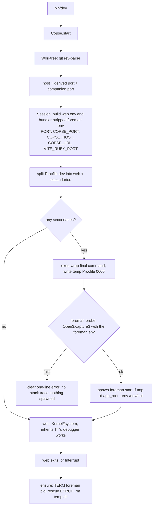

# feat: Copse — per-worktree hostnames and ports for Rails development

## Goal Capsule

- **Objective:** Ship `copse` to RubyGems — a development-only gem that gives every Rails app and every git worktree on a machine its own hostname and its own port, with no daemon, no DNS configuration, and no privileged listener.
- **Current state (reconciled 2026-07-21):** Greenfield. The repository holds only `.gitignore` and this plan — none of the gem source exists yet. An earlier draft described the core as "built and tested" and marked U3 and U6 as "Landed"; that was not true of this checkout, so **every unit is to be built from scratch**, along with the gem scaffolding (gemspec, `Rakefile`, `lib/copse.rb`, test harness).
- **Product authority:** This plan's Product Contract. Where it conflicts with the README to be written, the plan wins and the README is written to match.
- **Execution profile:** Small, self-contained Ruby gem. No app integration, no migrations, no services. Ruby >= 3.2.0, Minitest, zero runtime dependencies.
- **Stop conditions:** Stop and ask if a unit's findings would require introducing a background daemon, a reverse proxy, a privileged listener, or a runtime dependency. Each reverses a settled decision (KTD1, KTD6) and changes what the gem is.
- **Tail ownership:** **This checkout has no git remote configured** (`git remote -v` is empty). The build lands as local commits on `feat/copse-per-worktree-dev`; creating the GitHub repository, pushing, opening a PR, and running `gem push` are all human-gated steps the pipeline does not perform. The pipeline's job ends at a buildable, tested gem with CI config in place.

---

## Product Contract

### Summary

Every Rails app defaults to port 3000, so the second one on a machine will not boot. Copse gives each app and worktree a derived hostname and a derived port, so nothing collides and nothing has to be chosen. The hostname is not routing traffic — it gives each app a distinct browser origin, which removes the shared-cookie-jar problem. Because no proxy is involved, the gem installs with a Gemfile line and a generator and runs nothing in the background.

### Problem Frame

A developer running several Rails apps, or several worktrees of one app, currently hand-assigns ports with `-p 3001` and then cannot remember which app owns which number. Teams do it differently from each other, so URLs are not shareable. Worse, everything lands on `localhost`, so all apps share one cookie jar and one `localStorage`: signing into one signs the developer out of the others, and any app with subdomain or session behavior acts nothing like production.

The existing answer is puma-dev, which solves naming well but moves the web server into a background daemon. That costs the foreground TTY, and with it `binding.irb` and interactive debugging. Rails' own `bin/dev` has the mirror-image problem: it keeps everything local but multiplexes stdin and stdout through foreman, which makes the debugger unusable (rails/rails#52459). Neither path gives a developer both a stable name and a working debugger.

### Requirements

**Naming and addressing**
- R1. A project's main worktree is reachable at `<project>.localhost`, derived from the main worktree's directory name, dasherized.
- R2. A linked worktree is reachable at `<branch>.<project>.localhost`, derived from its current branch.
- R3. A worktree on a detached `HEAD` falls back to its directory name as the slug.
- R4. Each hostname maps to a port that is a pure function of that hostname, so it is identical across reboots, terminals, and teammates without any stored state.

**Process management**
- R5. The `web` process from `Procfile.dev` runs in the foreground and owns the TTY, so `binding.irb` and `debug` behave as they do under a bare `rails server`.
- R6. All other `Procfile.dev` processes run under foreman and are terminated when the foreground process exits.
- R7. An app with no `Procfile.dev` boots `bin/rails server` rather than failing.
- R8. Every process started by Copse receives `PORT`, `COPSE_HOST`, and `COPSE_URL`.

**Rails integration**
- R13. In development, when the app was booted by Copse and has not set its own `host`, `default_url_options` for routes and Action Mailer resolve to the Copse hostname and port.
- R14. Rails reports the Copse URL on boot.
- R15. A plain `bin/rails server` and any non-development environment are unaffected.

**Installation**
- R9. `bin/rails generate copse:install` points `bin/dev` at Copse and creates a minimal `Procfile.dev` only when the app has none.
- R10. The generator is idempotent and never silently overwrites an existing `Procfile.dev`.

**Packaging**
- R11. The gem declares zero runtime dependencies.
- R12. The gem is installable from RubyGems and its README documents the trade it makes against puma-dev.

### Acceptance Examples

- AE1. Five apps, one worktree each. Given five Rails apps in sibling directories, when each runs `bin/dev`, then all five boot simultaneously on distinct hostnames and distinct ports. (Covers R1, R4)
- AE2. Three worktrees, one project. Given `~/code/cora` on `main` plus `~/code/cora-fix-billing` on `fix-billing`, when both run `bin/dev`, then they resolve to `cora.localhost` and `fix-billing.cora.localhost` on different ports. (Covers R2, R4)
- AE3. Debugger survives. Given a `Procfile.dev` with `web` and `css`, when a request hits a `binding.irb`, then the prompt appears and echoes keystrokes. (Covers R5, R6)
- AE4. Existing Procfile preserved. Given an app whose `Procfile.dev` already has a `tailwindcss:watch` line, when the generator runs, then that file is untouched. (Covers R10)

### Scope Boundaries

**Deferred for later**
- Parsing or rewriting JS bundler config files to assign ports. Copse sets the vite dev-server port through `VITE_RUBY_PORT` only (U2, KTD10); no other supported bundler has a port to derive.

**Outside this product's identity**
- No reverse proxy, no background daemon, no TLS, no certificate authority. Removing `:3000` from the URL is not worth a privileged listener; puma-dev already occupies that trade and does it well.
- No port registry, lock file, or coordination service. Derived-and-uncoordinated is the design (KTD3).
- No `/etc/hosts` management. If a host needs an entry, the gem documents it rather than editing system files.

**Deferred to Follow-Up Work**
- Creating the GitHub repository, pushing the branch, and opening the PR — this checkout has no remote (see Tail ownership).
- Actual `gem push` to rubygems.org is a human-gated release action (see U5).
- Fixing foreman's own compound-command orphan bug upstream. Copse works around it locally (U1); an upstream PR to `ddollar/foreman` is out of scope.

### Outstanding Questions

- Q1. (deferred) Should the gem ship a way to raise the collision ceiling for developers running 40+ worktrees, where the measured rate reaches 10%? Every mechanism that would fix it needs shared state. Not worth it until someone asks.
- Q2. (deferred) Should the gem support a per-app name override — a `.copse` file or a `Copse.name =` setting — for teams whose directory name differs from the name they want in the URL? No demand yet; derived-only until asked.
- Q3. (new, deferred to U6/U4 findings) `*.localhost` resolves to `::1` **before** `127.0.0.1` on macOS 26 (verified locally: `Addrinfo.getaddrinfo("feat-billing.cora.localhost", nil)` → `["::1", "127.0.0.1"]`). Rails' dev server binds IPv4 loopback by default. Browsers recover via Happy Eyeballs; `curl` may not. If U4's matrix shows a real failure, the fix is a documented `-b ::1`/dual-bind note in the README, **not** a change to Copse's binding behavior. Do not pre-solve this. U4 owns producing the finding — its matrix must include a connect-level column, not just a resolves column.
- Q4. (open — review surfaced a genuine tradeoff, unresolved by choice) `vite_ruby`'s example `Procfile.dev` ships `web: bin/rails s --port 3000`, and an explicit `--port` beats the `PORT` environment variable (`railties-8.0.4/lib/rails/commands/server/server_command.rb:213` reads `options[:port] || ENV.fetch("PORT", …)`). So a stock vite app would silently boot on 3000 and defeat the whole design. Two defensible answers, and the plan does not pick one: **strip the port flag** from the `web` command before running it (`-p N`, `--port N`, `--port=N`), which makes the stock template just work but means Copse performs surgery on a command it did not author; or **refuse to boot** with one line naming the offending flag and telling the developer to remove it, which keeps Copse out of other people's command strings but breaks a documented upstream template. Decide before U7 ships; do not let the implementation settle it silently. Note the same question does not arise for the `env`-prefixed form, which needs no rewriting.
- Q5. (open — review surfaced) Should `Copse.ports=` and `Copse.reserved_ports=` ship in 0.1.0 at all? They are public, semver-supported API with **no consumer anywhere in this plan** — no unit reads a configured range, no requirement mentions configurability, and the only test that touches them exists to prove the memo invalidation the setters themselves introduce. They also quietly build the knob for the deferred Q1 while the Definition of Done claims Q1 is not implemented, and the memoization is live state in a component whose entire selling point (R4) is purity. The alternative is frozen constants (`Copse::PORT_RANGE`, `Copse::RESERVED_PORTS`) computed once at load, with the reserved-port and pinned-digest tests covering the range instead. Decide before U0 ships the accessors.

### Sources

- rails/rails#52459 — DHH's proposal to run the web process in the foreground and delegate the remaining `Procfile.dev` entries to foreman. This is the shape U1 must preserve.
- `ActionDispatch::HostAuthorization::ALLOWED_HOSTS_IN_DEVELOPMENT` — **verified locally** in `actionpack-8.0.4/lib/action_dispatch/middleware/host_authorization.rb:23`: `[".localhost", ".test", IPAddr.new("0.0.0.0/0"), IPAddr.new("::/0")]`. No `config.hosts` change is needed on Rails 8.
- RFC 6761 §6.3 — reserves `localhost` and `.localhost` as special, but with **SHOULD**, not MUST. This is why resolution is inconsistent and why U4 exists.
- puma-dev — the incumbent and the honest alternative for anyone who wants a bare `https://app.test`.

---

## Planning Contract

### Key Technical Decisions

- KTD1. No daemon and no reverse proxy. (session-settled: user-directed — chosen over a puma-dev-style background daemon and over generating a Caddy config: a daemon takes the web process off the TTY, which is the debugger property this gem exists to keep.)
- KTD2. The hostname carries identity, not routing. Requests still go to a port; the name exists to give each app a distinct browser origin. (session-settled: user-approved — chosen over proxying by `Host` header: the origin isolation is the valuable half, and it needs no listener.)
- KTD3. Ports are derived by CRC32 of the hostname onto the available ports in `3000..9999`, with no coordination. (session-settled: user-approved — chosen over a shared registry or bind-and-probe: both reintroduce state, and probing breaks the stable-across-terminals property in R4.) **Research strengthens this:** `Zlib.crc32("cora.localhost")` returns `2029036835` identically on Ruby 3.2.2, 3.3.3, and 3.4.7 (verified locally), so the derived port is stable across Ruby versions as well as across machines — R4 holds on a dimension the requirement did not even claim.
- KTD3a. Well-known service ports inside the range are excluded from derivation rather than probed around, so derivation stays pure. Widening from `3000..3999` to `3000..9999` drops the ten-name collision rate from **~4.5% to ~0.64%**. These are the exact birthday figures for the available-port counts (10 names over ~975 available ports in the narrow range → 4.52%; over ~6,975 in the wide range → 0.64%); an earlier draft cited 3.5% for the narrow range, which does not follow from the model and understated the improvement. Q1's "10% at 40 worktrees" checks out (10.60%). The collision-rate test asserts a **headroom** ceiling from a fixed seed, not the expected value itself — see U3.
  - **The bound is per port drawn, not per worktree.** A vite app draws two ports from the same set (U2), so ten vite worktrees is twenty draws and the rate is ~2.7%, not 0.64%. Q1's 10% ceiling is therefore reached at about twenty vite worktrees rather than forty. State the figure in draws wherever it is quoted.
- KTD4. A linked worktree's slug comes from its branch name, falling back to the directory name. (session-settled: user-approved — chosen over always using the directory name: conventional directory names like `cora-fix-billing` produce `cora-fix-billing.cora.localhost`, repeating the project.)
- KTD5. Installation is a Rails generator, not documentation. (session-settled: user-directed — chosen over README-only instructions: matches `tailwindcss:install` and lets the app commit a `bin/dev` the whole team shares.)
- KTD6. Zero runtime dependencies; `railties` is a development dependency in `Gemfile` only, never in the gemspec. Foreman is invoked as a subprocess, not required.
  - **Conflict call-out (proceed as settled, workable) — resolved to bundler-stripping.** Research found that `bundle exec foreman` fails *even when foreman is installed* if it is not in the app's Gemfile — `"foreman is not currently included in the bundle"`. Rails' own `bin/dev` sidesteps this by being a `/bin/sh` script that `exec`s foreman **outside** any bundle. Since `bin/dev` must load the bundle to `require "copse"` at all, foreman would inherit `BUNDLE_GEMFILE`/`RUBYOPT` and fail for essentially every app — so the decision is **strip the bundler environment before spawning foreman**, not "tell the developer to edit their Gemfile". The message path is reserved for foreman being genuinely absent for the active Ruby. Zero runtime dependencies is preserved either way; this only fixes which branch gets built.
  - **Consequence: there are two child environments, not one.** The `web` process **must keep** the inherited bundler env (it is the Rails app); foreman **must not**. A single assembled env cannot serve both, so U7 builds one shared set of Copse variables plus a foreman-only env with the bundler keys removed. Mechanism matters: passing `Bundler.original_env` as the spawn env hash still failed here, because `Process.spawn` **merges** rather than replaces — the inherited `BUNDLE_*` keys survive. Explicitly nil-ing the keys `Bundler.original_env` drops (or `unsetenv_others: true`) made the probe return `0.90.0`.
- KTD7. Teardown signals foreman's pid directly and lets foreman reap its own children. (session-settled: user-directed — chosen over signalling the process group via `Process.getpgid`: that can resolve to the caller's own group and kill the developer's shell session.) Do not reintroduce process-group signalling without a guard that the target group is not the caller's.
  - **Empirically confirmed:** SIGTERM to foreman's own PID reaped all children in ~0.7s with zero survivors. The rejected alternative is confirmed dangerous — `Process.getpgid(foreman_pid)` was measured **equal to the caller's own `Process.getpgrp`** and equal to the shell's, so `Process.kill("-TERM", pgid)` would have killed the developer's shell session. Source-verified in foreman 0.90.0: `Process.spawn` is called with **no `:pgroup`** (`lib/foreman/process.rb`); `pgroup: true` was added in commit `8c003b6d` and reverted three days later in `6ceabb11`; `Foreman::Engine#killall` (the only group-kill path) is dead code with one occurrence — its own definition. Termination flows exclusively through `kill_children`, which signals individual PIDs, then escalates SIGTERM → SIGKILL after a 5s default timeout (`-t/--timeout`).
- KTD8. **`exec` is inserted before the final command of a compound Procfile line when Copse writes the temporary Procfile — and pipelines are warned about, not wrapped.** Research reproduced an orphan: a line like `gamma: echo start; ruby -e 'sleep 300'` leaves the grandchild alive after foreman is TERMed, because Ruby's `Process.spawn` routes shell-metacharacter strings through `/bin/sh -c`, foreman records the `sh` PID, and `sh` does not forward SIGTERM (foreman issues #94, #384, #428 — open since 2011). Chosen over reintroducing a group kill (rejected by KTD7) and over accepting the orphan: Copse *authors* the temp Procfile, so it is the one component positioned to fix this without touching foreman or endangering the caller's process group.
  - **The transform is exact, because three nearby forms are all wrong.** Measured on this machine by simulating foreman (spawn the string, record the pid, TERM it): `echo hi; exec ruby -e 'sleep 300'` → **0 survivors** (correct); `exec sh -c "echo hi; ruby -e 'sleep 300'"` → **1 survivor**, because the recorded pid is still `sh`; `exec echo hi; ruby -e 'sleep 300'` → 0 survivors **but only because `exec` replaced the shell with `echo` and the second command never ran** — a silent no-op that would satisfy a naive regression test. So: insert `exec` before the **final** command of a `;` / `&&` / `||` chain. Never prefix the line, never wrap the line in `sh -c`.
  - **Pipelines cannot be fixed and must not be silently wrapped.** `ruby ... | cat` and `ruby ... | exec cat` both left 1 survivor: the recorded pid is the shell waiting on the whole pipeline, and a pipeline cannot be collapsed into one pid by any `exec` placement. Drop `|` from the wrapping set. A piped secondary is left unmodified, emits one warning line naming the process and stating that its grandchildren may survive teardown, and the limitation is documented in the README.
  - **The same limit applies when the long-running process is not last.** `sleep 300; echo done` and `sleep 300 & echo done` both orphan regardless of `exec` placement. Treat these like pipelines: warn, do not wrap.
- KTD9. **Foreman availability is determined by probing, not by locating the executable.** `command -v foreman` and `File.executable?` both succeed on an rbenv shim whose gem is absent, and the real invocation then dies with a `Gem::GemNotFoundException` stack trace (reproduced locally under Ruby 3.2.2). Chosen over a PATH/file check: only running `foreman version` through `Open3.capture3` **with the same environment the real spawn will use** distinguishes working-foreman from shim-that-explodes and from the bundler case in KTD6's call-out. Capturing stderr is the point — that is what keeps the stack trace off the developer's screen.
- KTD11. **The derived port is also exported as `COPSE_PORT`, because foreman rewrites `PORT` for its own children.** Source-verified in foreman 0.90.0: `base_port` is `options[:port] || env["PORT"] || ENV["PORT"] || 5000`, and each child is spawned with `"PORT" => (base_port + index * 100).to_s` (`engine.rb:271-275`, `:368`). So a secondary does not see the derived port — the first sees the same port as `web`, the third sees derived+200, which can leave `3000..9999` entirely or land on a KTD3a-reserved port. Chosen over passing `foreman start -p` (which only moves the same arithmetic) and over accepting the rewrite: R8 promises every process receives the port, and `COPSE_PORT` is the one name foreman does not touch. Secondaries that need the app's port read `COPSE_PORT`; `PORT` remains for the foreground `web` process, which foreman never sees.
- KTD10. **Only `vite_ruby` receives a companion port.** Research confirmed by execution that `VITE_RUBY_PORT` is the correct variable (`ViteRuby::ENV_PREFIX = "VITE_RUBY"`, env takes precedence over `config/vite.json`, default `3036`), and that esbuild-via-`jsbundling-rails`, `cssbundling-rails`, `tailwindcss-rails`, Propshaft, and importmap **have no port at all** — they watch-and-write to `app/assets/builds` and are served by the Rails process on Copse's derived port. Chosen over exporting a generic companion-port variable for "each supported bundler": there is exactly one bundler with a port to collide on, so U2 is one variable, not a matrix.

### High-Level Technical Design

Two objects, a generator, and a railtie.

- `Copse::Worktree` answers "what am I called and what port do I get" by shelling out to git. It holds no state and touches no files. The host slug is the branch of a linked worktree (KTD4), falling back to the directory name on detached HEAD (R3); the main worktree uses its directory name (R1). The port is a pure CRC32-of-hostname mapping onto the available-ports set (KTD3, KTD3a).
- `Copse::Session` answers "how do I boot" by splitting `Procfile.dev` into the foreground `web` process and the rest. `web` runs through `Kernel#system` so it inherits the terminal directly (R5); the remaining lines get `exec` inserted before their final command and are written to a temporary Procfile (KTD8), run under a `foreman start -d <app root>` subprocess (R6) when there are any; teardown TERMs foreman's pid (KTD7). An app with no `Procfile.dev`, or one with no secondaries, boots the foreground process alone and never touches foreman (R7). Every child sees `PORT`, `COPSE_PORT`, `COPSE_HOST`, `COPSE_URL`, and `VITE_RUBY_PORT` — the last is always exported and simply unconsumed by non-vite apps (R8, KTD10, KTD11).
- `Copse::Railtie` sets `default_url_options` for routes and Action Mailer from the exported env and prints the boot line, guarded three ways (development only, `COPSE_URL` present, app has not set its own host) — R13/R14/R15.
- `Copse::Generators::InstallGenerator` rewrites `bin/dev` to call Copse and writes a minimal `Procfile.dev` only when absent (R9/R10).



The load-bearing property is that `web` runs through `system` rather than through foreman, so it inherits the terminal directly. Everything else serves that.

**Exit-path decision table** — the three exits U1 must prove, and what each relies on:

| Exit | Path | What reaps the secondaries |
| --- | --- | --- |
| `web` exits on its own | `system` returns → `ensure` | Copse's `TERM` to foreman's pid |
| `Ctrl-C` at the prompt | TTY delivers `SIGINT` to the whole foreground group → `Interrupt` raised in Copse → `ensure` | The TTY reaches foreman's children directly (foreman does not `setsid`); Copse's `TERM` is belt-and-suspenders, so `Errno::ESRCH` is the expected case and must be rescued, not reported |
| `SIGTERM` to the Copse process | trap → `ensure` | Copse's `TERM` to foreman's pid |

### Output Structure

```text
copse/
├── copse.gemspec
├── Gemfile
├── Rakefile
├── README.md
├── CHANGELOG.md
├── LICENSE.txt
├── .github/
│   └── workflows/
│       └── ci.yml
├── lib/
│   ├── copse.rb
│   ├── copse/
│   │   ├── version.rb
│   │   ├── worktree.rb
│   │   ├── session.rb
│   │   └── railtie.rb
│   └── generators/
│       └── copse/
│           ├── install_generator.rb
│           └── templates/
│               ├── dev.tt
│               └── Procfile.dev.tt
└── test/
    ├── test_helper.rb
    └── copse_test.rb
```

The tree is a scope declaration, not a constraint; the per-unit **Files** sections are authoritative for what each unit creates.

### Assumptions

Reclassified after research — verified facts are now separated from the assumptions that remain.

**Verified (no longer assumptions):**
- Foreman terminates its own children on a direct-PID `SIGTERM`. Confirmed empirically and in foreman 0.90.0's source (see KTD7). **Exception:** compound shell commands orphan grandchildren — KTD8 handles this.
- Rails' development host allowlist includes `.localhost`. Read directly from `actionpack-8.0.4` on this machine. No `config.hosts` line is needed on Rails 8.
- `Zlib.crc32` is byte-identical across Ruby 3.2.2 / 3.3.3 / 3.4.7, so derived ports are stable across Ruby versions.
- `*.localhost` resolves on this machine (macOS 26.5.2) at the OS level, including nested labels, with no `/etc/hosts` entry.

**Still assumed:**
- Foreman is available on the developer's PATH at runtime for apps that have secondaries, invoked as a subprocess rather than depended on as a gem in the gemspec (KTD6). It is **not** installed under this machine's Ruby 3.2.2 — the rbenv shim raises `Gem::GemNotFoundException` — so U1 adds foreman to the gem's own `Gemfile` as a development dependency to make the teardown tests actually run, and U7's probe path (KTD9) is exercised here rather than being an edge case. Note foreman presence is per-Ruby-version under rbenv: a developer switching Ruby versions will see Copse break with no code change, which the error message should hint at.
- Foreman's signal, cwd, and PORT-rewriting behavior is verified against **0.90.0 only**, and foreman is supplied by the developer at whatever version they have. U7 warns below that floor rather than assuming; a future foreman that changes `kill_children`, adds `pgroup`, or drops the per-child PORT arithmetic would invalidate KTD7, KTD8, or KTD11 respectively.
- `exec` semantics for compound lines were measured against macOS `/bin/sh` (bash in sh mode). CI runs `ubuntu-latest`, where `/bin/sh` is dash — the KTD8 regression test is the check that the transform holds there too, which is part of why the CI matrix includes both OSes.
- Bare-glibc Linux (no `systemd-resolved`/`nss-resolve`) does **not** resolve `*.localhost`. Strongly indicated by nodejs/node#50871 and dotnet/runtime#120376 but not first-hand tested — U4 must verify or mark the cell unverified rather than assert it.
- Behavior on macOS 15 and earlier (Safari and `curl` failing to resolve `*.localhost`) rests on the WebKit #160504 comment thread, not on a machine this plan can test. U4 marks it as reported-not-verified.

### Sequencing

Greenfield, so U0 (scaffolding) lands first and everything depends on it.

**Then U4's resolution matrix is *measured* — before anything else is built.** Split U4: the measurement half runs immediately after U0, because it needs no Copse code at all (a resolver check and a `curl` per client and OS), and two of its cells are the plan's own untested assumptions. One of them — bare-glibc Linux — decides whether the hostname half of the product works on Linux at all. Discovering that after nine units are written and tested is the most expensive possible ordering, and front-loading it costs nothing. The README write-up half of U4 stays last, once there is real behavior to document.

After that: the identity/port core (U3 — needed by Session and Railtie), the session's pure inputs (U7 — parsing, environment, temp Procfile, foreman preflight), the session lifecycle (U1), Rails integration (U6), the install generator (U9), and the companion port (U2). U5 (release engineering) lands last.

U7 was split out of U1 during planning because research grew U1 past one atomic commit: preflight, Procfile authoring, and web-line parsing are pure functions testable without a process tree, while U1's three exit paths need a real one. Keeping them together would have mixed a fast unit-testable diff with a slow process-spawning one. **U1 remains the risk unit** — its exit paths, plus the compound-line orphan (KTD8) that U7 fixes and U1 proves end-to-end, are where this build can be quietly wrong.

---

## Implementation Units

### U0. Gem scaffolding and test harness

- **Goal:** A buildable, testable, zero-runtime-dependency gem skeleton that the remaining units fill in.
- **Requirements:** R11 (zero runtime deps); foundation for all others.
- **Dependencies:** none.
- **Files:** `copse.gemspec`, `Gemfile`, `Rakefile`, `README.md`, `lib/copse.rb`, `lib/copse/version.rb`, `test/test_helper.rb`, `test/copse_test.rb`, `.gitignore`.
- **Approach:** Minimal flat gem layout. `copse.gemspec` declares **zero dependencies of any kind**; `railties`, `minitest`, `rake`, and `foreman` are development dependencies in **`Gemfile` only, never in the gemspec** (KTD6 — a `add_development_dependency` in the gemspec would violate the settled decision, and the "zero runtime dependencies" check would not catch it). `required_ruby_version = ">= 3.2.0"` — matching Rails 8.1's own floor, and required because this machine runs 3.2.2. `lib/copse.rb` defines the `Copse` module, its configuration accessors (`ports=`, `reserved_ports=` with memo invalidation — see U3), and the top-level `Copse.start` entry point that `bin/dev` calls. `Rakefile` wires the default task to Minitest. Guard the railtie require (`require "copse/railtie" if defined?(Rails::Railtie)`) so a non-Rails consumer never fails to load. Only stdlib is used: `zlib`, `socket`, `open3` — all confirmed present and `require`-able on 3.2.2, 3.3.3, and 3.4.7.
- **Patterns to follow:** `andrew-kane-gem-writer` conventions — flat `lib/<gem>.rb` + `lib/<gem>/*.rb`, thin gemspec, Minitest.
- **Test scenarios:** `Copse::VERSION` is a frozen string. `Copse.start` is defined. The gem loads cleanly with no `Rails` constant present (guarded railtie require does not raise).
- **Verification:** `rake test` runs; `ruby -Ilib -e "require 'copse'"` succeeds outside Rails.

### U3. Port and hostname derivation (identity core)

- **Goal:** Pure, stateless derivation of a hostname's port and of a worktree's hostname, with a documented collision bound.
- **Requirements:** R1, R2, R3, R4; KTD3, KTD3a, KTD4.
- **Dependencies:** U0.
- **Files:** `lib/copse/worktree.rb`, `lib/copse.rb` (config accessors), `test/copse_test.rb`.
- **Approach:** `Copse::Worktree` shells to git (`rev-parse --is-inside-work-tree`, `--show-toplevel`, `--abbrev-ref HEAD`, and the main-worktree path) to decide project name and branch. Host: main worktree → dasherized directory basename `<project>.localhost` (R1); linked worktree → `<branch>.<project>.localhost` (R2, KTD4); detached HEAD → directory basename as slug (R3). Port: `Zlib.crc32` of the full hostname string mapped onto the **available** ports set = `(3000..9999)` minus ~25 well-known service ports, ≈6,975 ports (KTD3, KTD3a). A reserved port is unreachable by construction (index into the available array), never avoided by probing. `Copse.ports=` and `Copse.reserved_ports=` invalidate the memoized available-list so reconfiguration cannot go stale.
  - **The slug transform is a whitelist, not "dasherize".** `git check-ref-format --branch` accepts `feat;id`, `feat$(id)`, `a&&b`, `a|b`, and `a'b`, and `String#dasherize` only maps `_` to `-` — so it removes none of them. Since the slug reaches `COPSE_HOST`, `COPSE_URL`, every child's environment, `default_url_options[:host]` (U6), and the generated Procfile, and since branch names arrive from collaborators via `git fetch` rather than being the developer's own input, specify the transform explicitly: downcase, replace every run of `[^a-z0-9]` with a single `-`, strip leading and trailing hyphens, truncate to 63 characters, and fall back to the directory basename if the result is empty. The result must match `/\A[a-z0-9]([a-z0-9-]*[a-z0-9])?\z/`. This preserves KTD4 — the slug still comes from the branch — and only pins down how.
  - **Non-git and no-git cases.** R1–R3 all assume a git worktree, but Copse must not explode in a plain directory or on a machine without git on PATH. Both degrade to the same place: use the current directory's basename as the project slug and derive normally. Nothing about the derivation needs git — git only *answers* the naming question more precisely. Treat a failed `git rev-parse` (non-zero status, or `Errno::ENOENT` when git is absent) as "not a worktree" rather than an error, so a non-Rails-app directory or a git-less container still boots.
- **Test scenarios:**
  - `Covers AE1 / AE2.` Distinct hostnames derive distinct ports across a representative sample; the same hostname derives the same port on repeated calls (R4 stability).
  - Derived ports never land on a reserved port.
  - Collision rate over 20,000 ten-name trials generated from an explicitly seeded `Random.new(<fixed seed>)` stays under a **1.0% headroom ceiling**. The seed is required and the ceiling is headroom, not the expected value: the analytic mean is 0.64% with σ ≈ 0.057 pp over 20,000 trials, so asserting the documented 0.7% against an unseeded sample would go red about one run in six with no defect present. Keep 0.64% as the figure quoted in the README.
  - A digest of the entire available-ports array matches a pinned constant — not just one port. Ports are an index into an ordered set, so adding or removing a single reserved port shifts every index above it and moves most developers' ports, breaking R4's teammate promise across gem versions.
  - Reconfiguring `Copse.ports=` / `Copse.reserved_ports=` takes effect immediately (memo invalidation) — see Q5 on whether these accessors ship at all.
  - Main worktree → `<project>.localhost`; linked worktree on `fix-billing` → `fix-billing.cora.localhost`; detached HEAD → directory-name slug.
  - Branch names `feat;id`, `feat$(id)`, `a&&b`, `feat/foo`, `Feat_Bar`, and a 200-character name each produce a slug matching `/\A[a-z0-9]([a-z0-9-]*[a-z0-9])?\z/` no longer than 63 characters.
  - Two branch names that differ only outside the whitelist (`feat/billing` and `feat-billing`) collapse to the same slug — assert this is true and documented, since it is a collision path outside the measured model.
  - A known hostname derives a known constant port — pin one literal expectation so a future refactor of the mapping cannot silently move every developer's port.
  - A directory that is not a git worktree → directory-name slug, no raise.
  - `git` absent from PATH (`Errno::ENOENT`) → directory-name slug, no raise.
- **Verification:** `rake test` green for the identity suite; hostnames match R1–R3; collision-bound test passes.

### U7. Procfile parsing, environment, and foreman preflight

- **Goal:** Everything the session needs *before* it spawns anything: a parsed `Procfile.dev`, the child environment, a safe temporary Procfile, and a trustworthy answer to "will `foreman start` actually work".
- **Requirements:** R8; KTD8, KTD9, KTD11.
- **Dependencies:** U0, U3.
- **Files:** `lib/copse/session.rb`, `test/copse_test.rb`.
- **Approach:** Pure, spawn-free helpers on `Copse::Session` so they are testable without a process tree:
  - **Parse.** Split `Procfile.dev` into the `web` entry and the rest, matching the `web:` line **by name** — real templates ship `web: env RUBY_DEBUG_OPEN=true bin/rails server`, so never expect a bare `bin/rails server`. A `Procfile.dev` that exists but has **no** `web` line falls back to R7's behavior (run `bin/rails server` in the foreground) and treats every parsed line as a secondary; it must not hand `nil` to `Kernel#system`. A hardcoded port on the `web` line is Q4 — do not resolve it here.
  - **Two environments, from one source of truth (KTD6, KTD11).** Assemble the shared Copse variables once — `PORT`, `COPSE_PORT`, `COPSE_HOST`, `COPSE_URL` (R8), plus U2's companion variable — then derive two child environments from them: the **web** env keeps the inherited bundler environment untouched (it is the Rails app), and the **foreman** env has the bundler keys removed. Removing them requires explicitly nil-ing the keys `Bundler.original_env` drops (or `unsetenv_others: true`); passing `Bundler.original_env` as the spawn hash is **not** sufficient, because `Process.spawn` merges rather than replaces. `COPSE_PORT` carries the derived port to secondaries because foreman overwrites `PORT` for its own children (KTD11).
  - **Temp Procfile (KTD8).** Write the non-`web` lines to a temporary Procfile, inserting `exec` before the **final** command of a `;` / `&&` / `||` chain. Do not prefix the line and do not wrap it in `sh -c` — both were measured wrong (KTD8). Leave pipelines, background (`&`) forms, and chains whose long-running command is not last **unmodified**, and warn once per such line. Detection must be **quote-aware** and cover the full set that sends `Process.spawn` through `/bin/sh`: `;`, `&&`, `||`, `|`, `&`, newline, `$(`, backtick, `(`, `>`, `<` — a legitimate single argument like `bin/rails runner 'A.watch; B.watch'` must not be misread as compound.
  - **Temp file safety.** Create the temp Procfile inside a per-run `Dir.mktmpdir` (mode 0700) owned by the invoking user, write it mode 0600, and remove the directory in U1's `ensure`. The file's entire contents are commands foreman then executes, and derived hostnames are deliberately reproducible (R4), so a predictable path in a world-writable directory would be a symlink/TOCTOU surface.
  - **Foreman preflight (KTD9).** `Open3.capture3(foreman_env, "foreman", "version")`, check `status.success?`, rescue `Errno::ENOENT`/`Errno::EACCES`. Probe with the **foreman env built above** — the same one the real spawn uses — or the bundler case passes the probe and fails the run. Capturing stderr is the point: it keeps the `Gem::GemNotFoundException` trace off the developer's screen. Parse the version string the probe already captured and warn below the documented floor of **0.90.0**, since every signal guarantee in KTD7/KTD8/KTD11 is verified against that version. On failure, emit one clear line naming the likely cause (not on PATH / gem missing for the active Ruby) and mention that foreman presence is per-Ruby-version under a version manager.
- **Test scenarios:**
  - `web` line prefixed with `env ...` is still recognized as the foreground process.
  - `Procfile.dev` present with no `web` line → R7 fallback, every line treated as a secondary, no `nil` command.
  - A `Procfile.dev` with only a `web` line produces an empty secondary set (nothing to hand foreman).
  - Blank lines and `#` comments in `Procfile.dev` are ignored rather than parsed as entries.
  - Shared env contains `PORT`, `COPSE_PORT`, `COPSE_HOST`, `COPSE_URL`; the foreman env contains no `BUNDLE_*`/`RUBYOPT` keys while the web env retains them.
  - `exec` is inserted before the final command of a `;` chain; a simple line is left alone; a pipeline, an `&` form, and a chain whose long-running command is not last are each left unmodified **and** warned about.
  - A quoted `;` inside a single argument is not treated as compound.
  - Temp Procfile is written mode 0600 inside a 0700 directory.
  - Probe returns false when the executable is absent (`Errno::ENOENT`), and false when it exists but exits non-zero — with stderr captured, not printed.
  - Probe failure message names a cause and contains no backtrace; a foreman older than 0.90.0 warns.
- **Verification:** `rake test` green. These are pure functions — no process spawning in this unit's tests.

### U1. Session lifecycle and process teardown

- **Goal:** Boot the app with `web` in the foreground owning the TTY and the rest under foreman, and prove that exiting or interrupting leaves no orphaned foreman or watcher processes.
- **Requirements:** R5, R6, R7; KTD7.
- **Dependencies:** U0, U3, U7.
- **Files:** `lib/copse.rb`, `lib/copse/session.rb`, `test/copse_test.rb`.
- **Approach:** `Copse.start` resolves identity via `Copse::Worktree` (U3), assembles the two environments and the temp Procfile via U7's helpers, then runs the lifecycle:
  - **Foreman is conditional, not unconditional.** Compute the secondary set first. When it is empty — an app whose `Procfile.dev` has only a `web` line, which is exactly what U9's generator writes, or no `Procfile.dev` at all (R7) — run only the foreground process and **skip both the preflight and the spawn**. Preflighting a tool the run will never use would refuse to boot the most common app, and `foreman start` against an empty Procfile is itself fatal (`ERROR: no processes defined`, exit 1).
  - Run `web` through `Kernel#system` with the web env so it inherits the terminal directly (R5, rails/rails#52459 shape). This is the load-bearing property — nothing may be introduced between the TTY and the web process.
  - **Spawn foreman with the app root pinned:** `foreman start -f <temp procfile> -d <app root> --env /dev/null`, using the bundler-stripped foreman env. `-d` is not optional. foreman sets each child's cwd from the Procfile's own directory (`engine.rb:168` `options[:root] ||= File.dirname(filename)`, then `:cwd => options[:root]`), so without it a temp Procfile outside the app root makes every app-relative secondary — `bin/rails tailwindcss:watch`, `yarn build --watch` — die with `unknown command`. Copse's own cwd does not help; only `-d` does. `--env /dev/null` matches `jsbundling-rails` and `cssbundling-rails` and stops the app's `.env` clobbering the derived port.
  - **Notice foreman dying early.** After spawning, check `Process.waitpid(foreman_pid, Process::WNOHANG)` before entering the foreground `system`, and again at teardown. If foreman died while `web` was still running — a secondary whose binary is missing, or the empty-Procfile case — print one line naming its exit status. Without this, a developer edits CSS for an hour with no watcher running and gets no signal, because nothing monitors foreman while `web` holds the foreground.
  - **Teardown (KTD7):** in an `ensure`, `Process.kill("TERM", foreman_pid)` — the pid, never a negative pgid — rescuing `Errno::ESRCH`, then `Process.waitpid` rescuing `Errno::ECHILD`, then remove U7's temp directory. `Errno::ESRCH` is silent only when Copse already knows foreman was reaped by the TTY (the `Ctrl-C` path); it is reported when the early-death check above has not fired. See the exit-path decision table for what reaps the secondaries on each path.
  - **Rescue `Interrupt`** around the foreground `system` so `Ctrl-C` does not print a `Kernel#system': Interrupt` backtrace.
  - **Derived-port collision is accepted by design (KTD3) but must not be a mystery.** At ~0.64% per ten ports drawn, some developer will hit it. `Kernel#system` gives Copse only a non-zero status, not Puma's message, so detection is: on a non-zero `web` exit, check whether the derived port is now bound by a process Copse did not start, and if so name the port and the hostname and say another app or worktree derived the same one. This is error *reporting* after a failed bind, not the bind-and-probe KTD3 rejects for *derivation* — derivation stays pure. Attribute cautiously: a non-zero web exit has many causes, so the message is conditional on the port actually being held.
  - If foreman is ever found not to reap its children, add a group kill **guarded** so it refuses to signal the caller's own process group — never the unguarded form.
- **Execution note:** Exercise the real path with a real temp `Procfile.dev` and assert on process state after each exit; do not mock the process tree away. **Add `foreman` to the gem's `Gemfile` as a development dependency** — the gemspec stays at zero runtime dependencies (KTD6), and foreman is absent under this machine's Ruby 3.2.2, so without this the teardown tests would skip and the unit's entire purpose would go unverified. The secondary in the fixture must be an **app-relative** command (a script in the fixture's own `bin/`), not a bare `sleep`: `sleep` resolves from any working directory, so it would pass whether or not `-d` was passed and hide the P0 above.
- **Test scenarios:**
  - `Covers AE3.` Web exits normally → secondaries gone (no orphaned pids).
  - `Ctrl-C`/`SIGINT` mid-run → secondaries gone, and the `Errno::ESRCH` path does not surface as an error.
  - `SIGTERM` to the Copse process → secondaries gone.
  - An **app-relative** secondary (`css: bin/fake-watch`) actually starts — asserts `-d <app root>` reached foreman.
  - A compound secondary line (`foo: echo hi; sleep 300`) is observably **alive** before teardown (pid present or sentinel file written) and leaves **no** surviving grandchild after. Both halves are required: asserting only the absence of a survivor passes when the process never ran at all.
  - Teardown when the secondary already died on its own → does not raise.
  - Foreman dies immediately (secondary binary missing) → message names foreman's exit status rather than booting silently.
  - `Procfile.dev` with only a `web` line → boots with foreman absent from PATH entirely.
  - No `Procfile.dev` → boots `bin/rails server` with foreman absent from PATH entirely.
  - Temp directory is gone after each of the three exit paths.
  - Derived port already held by a foreign process → message names the port and the derived hostname.
- **Verification:** `rake test` green. Manual gates: `Ctrl-C` in a real Rails app with a Tailwind line in `Procfile.dev`, then `ps` confirms nothing survives; `binding.irb` in a controller shows a prompt that echoes keystrokes.

### U6. Rails URL integration (railtie)

- **Goal:** Generated URLs use the Copse hostname and port in development, and Rails prints the Copse URL on boot; everything else is untouched.
- **Requirements:** R13, R14, R15.
- **Dependencies:** U0, U3.
- **Files:** `lib/copse/railtie.rb`, `test/copse_test.rb`.
- **Approach:** Keep the railtie thin by splitting the decision from the wiring: a plain, Rails-free method computes *whether* to apply and *what* options to set, and the railtie only calls it. Guard three ways — `Rails.env.development?`, `COPSE_URL` present, and the app has not already set its own `host`. Set `Rails.application.routes.default_url_options` and Action Mailer's `default_url_options`, reaching Action Mailer via `ActiveSupport.on_load(:action_mailer)` — never `config.action_mailer`, which raises `NoMethodError` in apps that do not load Action Mailer. Print the boot line (R14). Puma's own `Listening on http://127.0.0.1:<port>` line still prints and is documented rather than worked around: it reports the bound address, and binding to the hostname would depend on the system resolver (see U4 and Q3).
- **Execution note:** The Rails-side behavior gets a real test, not a manual gate — but **only one `Rails::Application` can boot per process.** Verified against railties 8.0.4: after `AppOne.initialize!`, defining and initializing a second application raises `FrozenError: can't modify frozen Array`, `Rails.application` stays memoized to the first app (`rails.rb:46`), and re-initializing raises `Application has been already initialized.` So boot exactly **one** minimal app per test process — the development + `COPSE_URL`-present case — and cover the remaining guards against the Rails-free decision method, plus a `fork`ed child per alternate boot state. The harness app sets `config.root`, `config.eager_load = false`, and `secret_key_base` inline in `test/test_helper.rb`; there is no dummy app in the Output Structure and none is needed.
- **Test scenarios:**
  - With `COPSE_URL` set in development and no app-set host → routes and mailer `default_url_options` resolve to the Copse host/port.
  - App has already set its own `host` → Copse does not override.
  - Non-development environment → untouched.
  - `COPSE_URL` absent → untouched (plain `bin/rails server`).
  - Action Mailer not loaded → no `NoMethodError`.
  - The boot line names the Copse URL (R14).
- **Verification:** `rake test` green, including the booted-`Rails::Application` cases.

### U9. Install generator

- **Goal:** `bin/rails generate copse:install` wires an app to Copse idempotently.
- **Requirements:** R9, R10; KTD5.
- **Dependencies:** U0.
- **Files:** `lib/generators/copse/install_generator.rb`, `lib/generators/copse/templates/dev.tt`, `lib/generators/copse/templates/Procfile.dev.tt`, `test/copse_test.rb`.
- **Approach:** A `Rails::Generators::Base` subclass. Rewrites/creates `bin/dev` from `dev.tt` so it calls `Copse.start`, and `chmod +x`. Creates `Procfile.dev` from the template **only when the app has none** — never overwrites an existing one (R10, AE4). Idempotent: running twice is a no-op on an already-wired app. Matches the shape of `tailwindcss:install` (KTD5).
- **Test scenarios:**
  - `Covers AE4.` App with an existing `Procfile.dev` (e.g. a `tailwindcss:watch` line) → file untouched.
  - App with no `Procfile.dev` → minimal one created with a `web` line.
  - `bin/dev` created and executable, pointing at Copse.
  - Running the generator twice → no duplicate lines, no overwrite.
- **Verification:** `rake test` green; generator run in a scratch dir produces the expected `bin/dev` and preserves an existing `Procfile.dev`.

> U9 covers the install generator that an earlier draft referenced but did not enumerate as its own unit (it was folded into the "already built" core). Because this is a greenfield build it is explicit here, and R9/R10 and AE4 are owned by it.

### U2. Companion port for vite

- **Goal:** Two worktrees running vite no longer collide on the bundler's own port.
- **Requirements:** R4, R8; KTD10.
- **Dependencies:** U0, U3, U7.
- **Files:** `lib/copse/session.rb`, `README.md`, `test/copse_test.rb`.
- **Approach:** Derive the companion port the same way the primary one is derived, but from a **salted** hostname — `Zlib.crc32("vite:" + hostname)` mapped onto the same available-ports set — so it inherits R4's stability and KTD3a's reserved-port exclusion for free, with no second mechanism to maintain. If the salted result collides with the primary port for that same hostname, advance to the next index in the available set; that keeps derivation pure and terminating while guaranteeing the two are never equal. Export it as **`VITE_RUBY_PORT`** — verified as the correct variable (`ViteRuby::ENV_PREFIX = "VITE_RUBY"`; env takes precedence over `config/vite.json`; default `3036`). Do not parse or rewrite bundler config files. Two notes research settled: `vite-plugin-ruby` sets `strictPort: true`, so a collision is a clean immediate failure rather than a silent drift to `port+1` — good for determinism, but the error text comes from Vite, not Copse; and `VITE_RUBY_HOST` is *not* needed for port assignment, only for `ViteRuby::DevServerProxy`'s origin — export it only if the Rails-side proxy must reach the dev server at the derived hostname. **Scope narrowed by KTD10:** esbuild, cssbundling, tailwindcss, Propshaft, and importmap have no port at all, so there is no matrix of bundler variables to support. Say this plainly in the README rather than implying broader coverage.
- **Test scenarios:**
  - Companion port is stable for a hostname and differs across worktrees.
  - Companion port never equals the primary port for the same hostname.
  - Companion port is also drawn from the available set (never a reserved service port).
  - An app with no vite is unaffected — the variable is present in the env and nothing consumes it.
  - Collision rate measured with **two** ports per name (as a vite app actually draws) is reported alongside the one-port figure, so the documented bound matches what vite users experience: ten vite worktrees is twenty draws ≈ 2.7%, not 0.64% (KTD3a). Note the dedup rule only guarantees primary ≠ companion *within* one hostname — worktree A's companion can still equal worktree B's primary, and `strictPort: true` makes that a hard boot failure whose message comes from Vite, not Copse.
- **Verification:** `rake test` green. Manual gate: two worktrees of a vite app boot simultaneously and serve assets in both.

### U4. Hostname resolution matrix and README

- **Goal:** Establish where `*.localhost` actually resolves and write the README so it makes no claim contradicted by the facts.
- **Requirements:** R1, R2, R12.
- **Dependencies:** U0 (README exists), U1, U2, U3, U6, U7, U9 (so the README documents real behavior).
- **Files:** `README.md`.
- **Approach:** RFC 6761 §6.3 makes `.localhost` special with a **SHOULD**, not a MUST, which is why support is uneven. Research established the following; the README states it at this granularity rather than claiming "no `/etc/hosts` needed":

  | Client | Resolves `*.localhost`? | Connects to an IPv4-bound server? | Basis |
  | --- | --- | --- | --- |
  | Chrome / Edge | Yes, all platforms | Yes (Happy Eyeballs) | Built into the browser's own resolver (~Chrome 78) |
  | Firefox | Yes, all platforms | Yes (Happy Eyeballs) | Built in since Firefox 84 (Bugzilla 1220810) |
  | Safari | Yes on macOS 26+; no on macOS ≤ 15 | To verify | Fixed in the OS resolver, not WebKit (WebKit #160504, RESOLVED MOVED) |
  | `curl` / native macOS clients | Yes on macOS 26+; no on macOS ≤ 15 | **To verify — this is Q3** | Uses the system resolver |
  | Linux + `systemd-resolved` (`nss-resolve`) | Yes | To verify | `systemd-resolved.service(8)` |
  | Linux, bare glibc | No | n/a | Strongly indicated, **not first-hand verified** |

  **The two columns are different questions, and Q3 lives in the second one.** Resolution succeeding does not mean connection succeeds: `*.localhost` resolves `::1` before `127.0.0.1` on macOS 26 while Rails binds IPv4 loopback by default, so a client that does not fall back will resolve fine and then fail to connect. U4 owns producing this finding — run `curl` against a real IPv4-bound dev server on both a main-worktree and a nested-worktree hostname and record the result in the connect column. If it fails, add the `-b ::1`/dual-bind note to the README (per Q3, do **not** change Copse's binding behavior).

  Two honesty requirements. First, **do not offer an `/etc/hosts` fallback for Chrome** — Chrome ignores hosts entries for `.localhost` (chromium issue 41175806), so that advice is actively wrong there; scope the fallback to the clients where it works. Note also that neither glibc nor the macOS resolver supports wildcard hosts entries, so the fallback is **one line per derived hostname** — i.e. per branch — which the README must state plainly rather than implying a one-time setup. Second, mark unverified cells as unverified (macOS ≤ 15 and bare-glibc Linux are reported, not tested here) rather than presenting them as a verified matrix. Restate the puma-dev trade honestly: puma-dev's resolver approach does not have this gap, and for developers on the failing cells the README should say so directly.

  The README must also state, alongside the install instructions: that **foreman is a prerequisite** for apps with more than a `web` line (in the app's bundle, and per-Ruby-version under a version manager), the **minimum supported foreman version (0.90.0)**, that Copse **rewrites non-`web` Procfile lines** to prevent orphans and how to inspect the result, and that secondaries read `COPSE_PORT` rather than `PORT` (KTD11).
- **Test scenarios:** Test expectation: none — documentation unit. Verification is the manual matrix, recorded in the README as its own gate.
- **Verification:** README contains the matrix with verified/unverified cells distinguished, the correctly-scoped `/etc/hosts` fallback, and no overclaim.

### U5. Release engineering

- **Goal:** Everything needed to publish 0.1.0, with CI proving the suite on supported Rubies — up to but not including the human-gated `gem push`.
- **Requirements:** R11, R12.
- **Dependencies:** U0, U1, U2, U3, U4, U6, U7, U9 — everything.
- **Note:** `lib/copse/railtie.rb` and `lib/generators/**` (including `templates/`) must be in the packaged file list — the gem is useless if the templates are omitted.
- **Files:** `copse.gemspec`, `.github/workflows/ci.yml`, `LICENSE.txt`, `CHANGELOG.md`, `README.md`.
- **Approach:** Add the MIT `LICENSE.txt` the gemspec claims. Ensure the gemspec `files` list (or `git ls-files` glob) captures `lib/generators` and its `templates/`. Add `CHANGELOG.md` with a `0.1.0` entry. Confirm zero runtime dependencies remain. Two things research pinned:
  - **Ruby floor and CI matrix.** `required_ruby_version = ">= 3.2.0"`, matching Rails 8.1's own floor and this machine's 3.2.2 — noting that **Ruby 3.2 went EOL on 2026-04-01**, which is worth a README line but is not disqualifying (`tailwindcss-rails` and `propshaft` both still test 3.2). CI matrix `["3.2", "3.3", "3.4", "4.0", "head"]` × `[ubuntu-latest, macos-latest]`; both OSes are required because process reaping and `*.localhost` resolution are exactly where the platforms diverge. This machine's rbenv tops out at 3.4.7, so 4.0 is CI-only and untestable locally.
  - **`homepage` / `source_code_uri` / `changelog_uri` cannot be filled truthfully yet** — this checkout has no git remote and no GitHub repository exists. Leave them pointing at the intended canonical URL and record correcting-then-verifying them as an explicit pre-publish checklist item. A gemspec whose `source_code_uri` 404s must not be pushed.
- **Test scenarios:** Test expectation: none for CI/license/changelog themselves — packaging is verified by build, not unit test.
- **Verification:** `gem build copse.gemspec` succeeds; the built gem's contents include `lib/generators/copse/templates/*` and `lib/copse/railtie.rb`; installing the built gem into a scratch Rails app and running `copse:install` **from the installed gem** (not the working tree) works. CI green once a remote exists. Creating the repo, pushing, and `gem push` are left to the user.

---

## Verification Contract

| Gate | Command or check | Applies to |
| --- | --- | --- |
| Unit suite | `rake test` | U0, U1, U2, U3, U6, U7, U9 |
| Loads outside Rails | `ruby -Ilib -e "require 'copse'"` | U0 |
| No orphaned processes | Manual `Ctrl-C` in a real app, then `ps` | U1 |
| Secondary cwd | An app-relative secondary (`bin/`-prefixed) actually starts — proves `-d <app root>` | U1 |
| Compound-line orphan | `exec` placement asserted on the written temp Procfile; end-to-end test asserts the secondary was **alive** before teardown and gone after | U7, U1 |
| Boots without foreman | `Procfile.dev` with only a `web` line, and no `Procfile.dev`, both boot with foreman absent from PATH | U1 |
| Foreman probe | Automated: absent-executable and non-zero-exit both give one clean line, no backtrace; sub-0.90.0 warns | U7 |
| Debugger works | `binding.irb` in a controller under `bin/dev`, prompt appears and echoes | U1 |
| Multi-app boot | Five apps up simultaneously, distinct hostnames and ports | U3 |
| Vite companion port | Two worktrees of a vite app boot simultaneously and serve assets in both | U2 |
| Generator idempotent | Run `copse:install` twice in a scratch dir; existing `Procfile.dev` untouched | U9 |
| Resolution matrix | {Chrome, Firefox, Safari, curl} × {macOS, Linux}, **resolve and connect columns separately**, unverified cells marked. Measured right after U0, not last. | U4 |
| Packaged correctly | `gem build`, inspect contents, install, run generator from the installed gem | U5 |
| CI | Green across `3.2`–`head` on `ubuntu-latest` and `macos-latest` — **requires a remote; deferred** | U5 |

The unit suite is fast and has no external dependencies, so it runs on every unit. The manual gates exist because TTY behavior and browser resolution cannot be proven in a headless in-process test. **CI cannot be exercised in this checkout** (no remote) — the workflow file is written and reviewed, not observed green.

---

## Definition of Done

**Global**
- Every requirement is verified by a test or by a named gate above, with one declared exception: **R12 is split.** Its README half is verified by U4/U5; its "installable from RubyGems" half is explicitly deferred and human-gated (no remote exists — see Tail ownership), tracked by U5's pre-publish checklist rather than claimed as done. Do not assert blanket R1–R15 coverage while the objective's last mile is unowned.
- The README makes no claim contradicted by U4's findings, marks unverified cells as unverified, and does not present the `/etc/hosts` fallback as a one-time step (it is one line per branch) or offer it for Chrome (which ignores it).
- The Goal Capsule's "no DNS configuration" is scoped to the clients where it holds, not stated unconditionally.
- Zero dependencies of any kind in the gemspec; dev dependencies live in `Gemfile` only.
- `rake test` green locally on Ruby 3.2.2. CI green is deferred until a remote exists.
- Q1 and Q2 remain open by choice and are not implemented. Q3 is answered by U4's connect column. **Q4 (hardcoded `--port`) and Q5 (`Copse.ports=` accessors) must each be decided before the unit that depends on them ships — not settled silently by whatever the implementation does first.**
- No dead process-group signalling code remains (KTD7).
- The gem loads cleanly both inside and outside Rails.

**Per unit**
- U0: gem builds and the test harness runs; loads outside Rails.
- U3: derivation is pure and stable; the seeded collision test passes against a headroom ceiling; reserved-port and pinned available-set-digest tests pass; the slug transform is a whitelist and shell metacharacters in branch names cannot survive it; hostnames match R1–R3; a non-git directory and a git-less machine both degrade to the directory-name slug without raising.
- U7: the `web` line is found whether or not it is `env`-prefixed; a `Procfile.dev` with no `web` line falls back to R7 without handing `nil` to `system`; `exec` lands before the final command of a chain while pipelines and `&` forms are warned-not-wrapped; detection is quote-aware; the temp file is 0600 in a 0700 directory; the foreman probe distinguishes absent from broken, reports one clean line with no backtrace, and warns below 0.90.0.
- U1: all three exit paths leave no orphans; an app-relative secondary actually starts (proving `-d`); the compound-line regression asserts the secondary was alive *and* then gone; an app with no secondaries boots with foreman absent from PATH; foreman's early death is reported rather than silent; the temp directory is removed on every exit path; the debugger prompt echoes (manual gate). **The teardown tests must actually run** — foreman is in the dev `Gemfile` for exactly this reason, so a skip is a failure of this unit, not an acceptable outcome.
- U6: generated URLs use the Copse hostname in development and are untouched everywhere else, proven against a booted `Rails::Application`.
- U9: existing `Procfile.dev` preserved (AE4); generator idempotent; `bin/dev` wired.
- U2: companion port stable, distinct across worktrees, never equal to the primary, never a reserved port; README states plainly that vite is the only bundler with a port.
- U4: matrix published in the README with verified and unverified cells distinguished, and the `/etc/hosts` fallback scoped away from Chrome.
- U5: build includes generator templates and the railtie; generator runs from the installed gem; gemspec URL correction recorded as a pre-publish blocker. `gem push` left to the user.

---

## Sources & Research

External research ran and was load-bearing — it produced KTD8, KTD9, and KTD10, narrowed U2's scope, rewrote U4's matrix, added a conflict call-out to KTD6, and converted four assumptions into verified facts.

**Foreman signal semantics (KTD7, KTD8)** — `ddollar/foreman` v0.90.0 source: `lib/foreman/engine.rb` (`HANDLED_SIGNALS`, `handle_term_signal`, `kill_children`, `terminate_gracefully`, and the dead `killall`), `lib/foreman/process.rb` (`Process.spawn` with no `:pgroup`). Commits `8c003b6d` / `6ceabb11` (pgroup added and reverted in three days); PR #528; issues #94, #384, #428 (shell wrapping), #779 (detached grandchildren). Foreman is stable-but-frozen: last release 2025-07-27, and the signalling semantics have not changed since 2016.

**Foreman preflight idiom (KTD9)** — `rails/jsbundling-rails/lib/install/dev`, `rails/cssbundling-rails/lib/install/dev`, and `railties`' own `bin/dev.tt`, which are `/bin/sh` scripts that `exec` foreman outside the bundle and pass `--env /dev/null`.

**Bundler ports (KTD10)** — `vite_ruby` 3.10.2 source (`ENV_PREFIX`, `option_from_env`, `CONFIGURABLE_WITH_ENV`, `default.vite.json`) and `vite-plugin-ruby`'s `src/config.ts` (`strictPort: true`, `hmr.clientPort`), confirmed by execution. esbuild's own docs on watch-vs-serve (watch binds no port). Install templates for `jsbundling-rails`, `cssbundling-rails`, `tailwindcss-rails`.

**Ruby support (U5)** — ruby-lang.org branches page: 3.2 EOL 2026-04-01, 3.3 in security maintenance until ~2027-03, 3.4 and 4.0 in normal maintenance, 4.0.6 latest stable (2026-07-14). `rails/tailwindcss-rails` and `rails/propshaft` CI matrices as precedent for still testing 3.2. Rails 8.1 `required_ruby_version >= 3.2.0`.

**`*.localhost` resolution (U4)** — RFC 6761 §6.3 (SHOULD, not MUST); WebKit #160504 (RESOLVED MOVED, fixed in macOS 26's OS frameworks, not WebKit); Bugzilla 1220810 (Firefox 84); chromium issue 41175806 (Chrome ignores `/etc/hosts` for `.localhost`); `systemd-resolved.service(8)`.

**Verified first-hand on this machine** — macOS 26.5.2: `Addrinfo.getaddrinfo("feat-billing.cora.localhost", nil)` → `["::1", "127.0.0.1"]` with no wildcard hosts entry. `Zlib.crc32("cora.localhost")` → `2029036835` on Ruby 3.2.2, 3.3.3, and 3.4.7. `actionpack-8.0.4` `ALLOWED_HOSTS_IN_DEVELOPMENT` includes `".localhost"`. Foreman absent under Ruby 3.2.2 (rbenv shim raises `Gem::GemNotFoundException`), present under 3.4.2.

---

## Product Contract preservation

**Reviewed 2026-07-21.** A six-persona document review (coherence, feasibility, adversarial, scope-guardian, security-lens, product-lens) produced 46 findings, 30 actionable. Its highest-confidence findings were verified by execution against foreman 0.90.0 and railties 8.0.4 on this machine, not by inspection, and five would each have produced a build that passed its own tests while being broken: foreman's per-child cwd defeating every app-relative secondary without `-d`; the `exec`-wrapping transform being wrong in three nearby forms and vacuous in a fourth; the bundler-environment branch of KTD6 never having been chosen, with the unchosen default failing for essentially every app; an unconditional foreman preflight refusing to boot the app U9's own generator creates; and foreman rewriting `PORT` for its children, falsifying R8 for secondaries. Those are folded in above. Two findings became **Q4** and **Q5** rather than being resolved, because they are genuine tradeoffs the plan should not settle silently. The review applied **zero** silent fixes — no finding reached the anchor-100 + one-clear-answer bar that authorizes that — so every change above was made deliberately.

Product Contract unchanged in substance. Changes are confined to the Planning Contract and units: the Goal Capsule's current-state and tail-ownership narrative (greenfield; no git remote, so push/PR/publish are human-gated), three new Key Technical Decisions derived from research (KTD8 compound-line `exec`-wrapping, KTD9 probe-don't-locate for foreman, KTD10 vite-only companion port), a workable-conflict call-out on KTD6, empirical confirmation attached to KTD3 and KTD7, and the split of U1's pure inputs into a new **U7** (per the U-ID stability rule: U1 keeps the original lifecycle concept, U7 takes the next unused number). Two Scope Boundary entries were added under **Deferred to Follow-Up Work** (repo creation/push, upstream foreman fix) and one new deferred question (Q3, the `::1`-before-`127.0.0.1` ordering) — additive, and neither alters an existing requirement, acceptance example, or identity boundary. No R-ID, AE-ID, or scope boundary was modified or removed.
